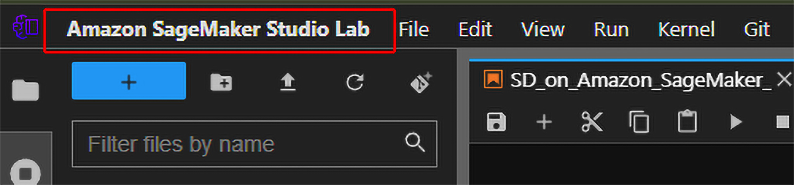
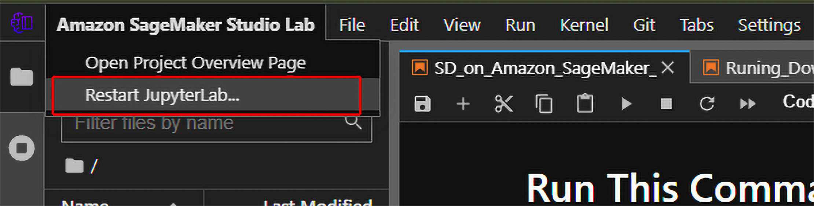
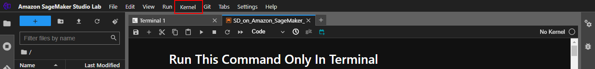
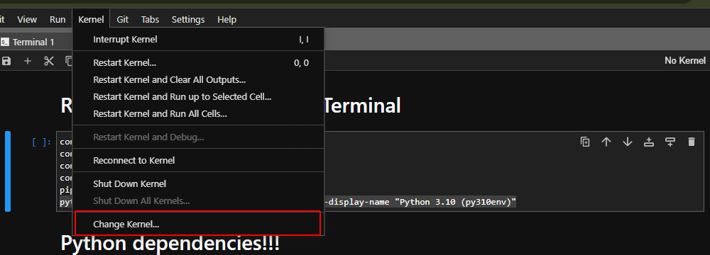
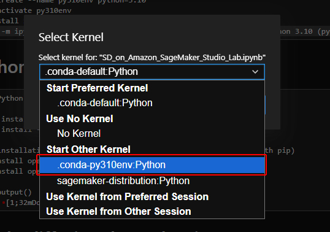
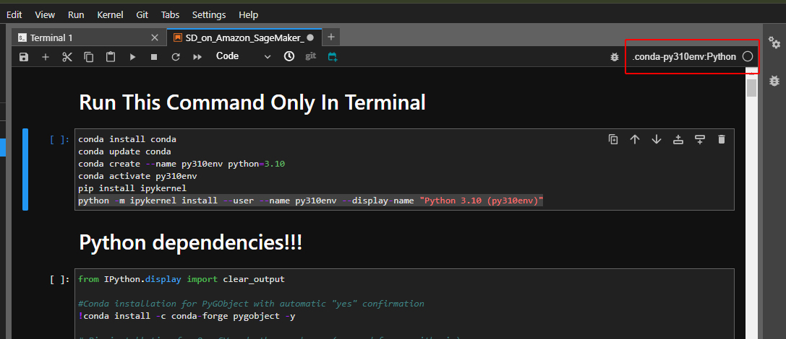

# Stable Diffusion Setup in Amazon SageMaker Studio Lab

This guide will help you set up Stable Diffusion in Amazon SageMaker Studio Lab, with specific instructions to keep everything running smoothly.

## 🔧 Installation Steps
# This all **Set Up the Environment** commands also given in Notebook
1. **Set Up the Environment**
   - Use the **terminal** to run all installation commands.
   # 1.1. Install and update Conda
```bash
conda install conda
conda update conda
```
# 1.2. Create a Python 3.10 environment
```bash
conda create --name py310env python=3.10
```
# 1.3. Activate the newly created environment
```bash
conda activate py310env
```
# 1.4. Install ipykernel and set up the environment as a Jupyter kernel
```bash
pip install ipykernel
python -m ipykernel install --user --name py310env --display-name "Python 3.10 (py310env)"
```
# 1.5. Verify Python 3.10 is active in the environment
```bash
python --version
```
2. **Running the Notebook**

   - Click on Amazon SageMaker Studio Lab
     
   

   - Click on Restart JupyterLab...

   

   - Select a Stable-Diffusion NoteBook and Click on Kernel
     
     

   - Click on Change Kernel
  
     

   - Select the .conda.py310env.Python Kernel
  
     

   - Makesure Kernel is selected
  
     
   - After setting up the environment, run the Stable Diffusion Python notebook.
   - 🚫 **Do not install any Python packages via the terminal**. Install all necessary Python packages inside the Python notebook.

4. **Downloading Models, LoRA, VAE, etc.**
   - You can download models (Stable Diffusion, LoRA, VAE) using both the **terminal** and the **Python notebook**.
   - **However, all Python packages must be installed in the notebook**, not through the terminal.

## ⚠️ Important Notes
- Only run commands related to package installation inside the Python notebook.
- You can use the terminal for downloading models, but avoid installing packages via the terminal.

---

## Example Commands for Downloading Models

### 1. Stable Diffusion Model
To download a Stable Diffusion model, use the following command in the terminal:
```bash
wget -O model.safetensors <stable-diffusion-model-download-link> -P /home/studio-lab-user/stable-diffusion-webui/models/Stable-diffusion/
```
### 2. Lora 
```bash
wget -O lora-model.safetensors <lora-model-download-link> -P /home/studio-lab-user/stable-diffusion-webui/models/Lora/
```
### 3. VAE
```bash
wget -O vae-model.safetensors <vae-model-download-link> -P /home/studio-lab-user/stable-diffusion-webui/models/VAE/
```
### 🔄 Downloading Models via the Python Notebook (WebUI Interface)

**If you want to download Stable Diffusion models, LoRA, and VAE directly while running  WebUI (Automatic1111) interface, you can do this through the provided Stable Diffusion Python** notebook name-- Runing-Downloader-Models. 
  
##  Requirements Ngrok Token
```bash
https://ngrok.com/
